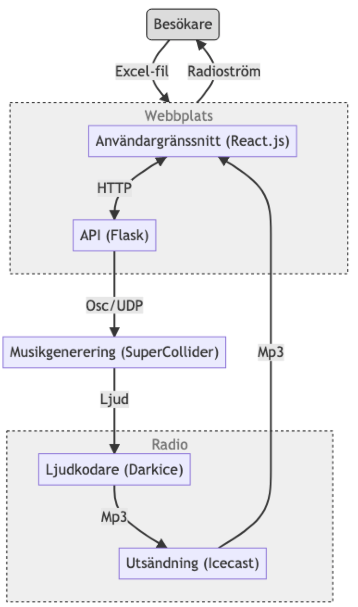
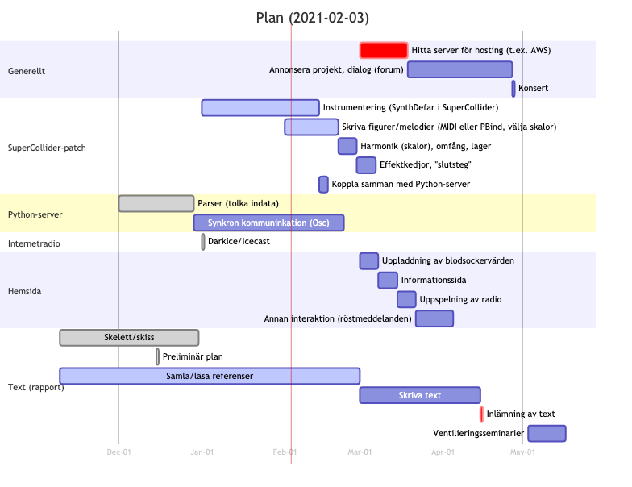

*Karl Johannes Jondell*: \today

# Preliminär plan för examensprojekt
Planen ska innehålla:

1. _Titel + undertitel + en mening som beskriver arbetet._
1. _Beskrivning av arbetet på max **en** A4-sida._
1. _Musik - vilken musik ingår i ditt självständiga arbete? Lista allt praktiskt._

## Titel, undertitel och mening
* ''_Värden och värden: en studie av kollektiv sonifiering_''
* Detta projekt kommer bestå av en hemsida där diabetiker kan ladda upp sina blodsockervärden, vilket påverkar/styr en ström oändligt genererad musik.

## Beskrivning av arbetet
Arbetet består i tre delar: dels bygga en hemsida där diabetiker kan ladda upp sina blodsockervärden, höra internetradiostation, läsa texter, interagera och ta del av projektet; dels bygga ett (*SuperCollider*-)program som genererar musiken; dels skriva om/problematisera/studera det större ämnet sonifiering (och även andra ämnen som berörs av projektet, bl.a.  upplevelserna av att ha diabetes). Dessa delar måste förstås även kopplas samman (SuperCollider-patchen beror av blodsockervärdena som delas till servern; patchen i sin tur strömmar musiken tillbaka till hemsidan, se figur nedan). Det mer konstnärliga arbetet i att bestämma hur värdena ska tolkas i musiken och balansen av hur styrd musiken är av mina stilistiska preferenser och blodsockervärdena sker kontinuerligt. Jag önskar även föra en dialog med diabetiker i existerande diabetes-communities.

## Musik
Musiken ska presenteras på en internetradiostation som jag bygger. I en eventuell examenskonsert presenterar jag musiken som då spelas på radiostationen. Den är evig och formen bestäms av huruvida nån har delat sina blodsockervärden (som då triggar igång tolkningen av dessa, och som är ''_aktiva_'' i ca. ett dygn). Allt ljud produceras med SuperCollider (ev. andra ''hjälp-program''). En spatialiserad (binauraliserad) version strömmas parallellt med en stereo-version.

